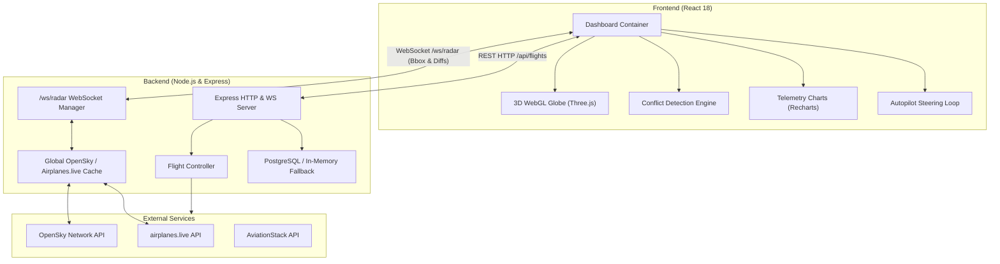

# ✈️ Flight Command Center (AERO-CORE)

[](https://reactjs.org/)
[](https://nodejs.org/)
[](https://github.com/websockets/ws)
[](https://github.com/vasturiano/react-globe.gl)
[](https://jestjs.io/)
[](LICENSE)

> A full-stack, real-time Air Traffic Control (ATC) intelligence and flight tracking platform. Integrates live ADS-B telemetry, a 3D WebGL digital globe, automated 4D conflict detection, manual autopilot steering simulation, storm weather radar, and carbon emission analytics.

---

## 🌟 Overview

**Flight Command Center (AERO-CORE)** is a production-grade web application designed for real-time flight tracking, air traffic surveillance, and spatial collision prediction. Built on React and Node.js, the platform streams global aircraft position data over low-latency WebSockets, renders dynamic 3D telemetry on a WebGL globe, and executes pairwise conflict detection to maintain standard ATC separation minima.

---

## ✨ Core Features

### 🌐 1. Interactive 3D WebGL Globe Radar
- Powered by `react-globe.gl` and `Three.js` with realistic atmospheric glow and night-sky shaders.
- **Level of Detail (LOD) Viewport Culling**: Dynamically calculates camera elevation and filters HTML DOM aircraft markers (e.g. rendering nearest ~25 to ~60 planes based on zoom) to preserve 60 FPS performance.
- **Event Forwarding Fix**: Custom wheel event interceptors on DOM plane markers re-dispatch scroll events directly to the WebGL canvas, eliminating dead-zones during zoom interactions.

### 📡 2. Real-Time ADS-B Telemetry & WebSocket Engine
- Streams real-time flight telemetry via OpenSky Network and `airplanes.live` APIs.
- **Centralized Server Polling & Caching**: The backend queries global state vectors once every 4–6 seconds, preventing API rate limits (`429 Too Many Requests`).
- **Diff-Based Pushes**: WebSockets send viewport bounding-box filtered updates containing only added, removed, or repositioned plane delta objects (`radar_diff`), minimizing payload size.

### ⚠️ 3. ATC Proximity & 4D Conflict Detection
- **Haversine Distance**: Computes horizontal great-circle distance between all visible aircraft pairs.
- **Separation Minima Enforcement**: Triggers alerts if horizontal separation falls below **5.0 Nautical Miles (9.26 km)** and vertical separation drops below **1,000 ft**.
- **4D Dead-Reckoning Trajectory Projection**: Projects aircraft positions forward in 15-second steps over a 5-minute horizon using velocity vectors and headings to compute Closest Point of Approach (CPA).
- Displays glowing red warning arcs, flashing HUD alerts, and CPA countdown metrics.

### 🕹️ 4. Manual Autopilot Steering Console
- Simulated Air Traffic Control override panel allowing users to switch a flight from `AUTO` to `MANUAL` mode.
- Interactive sliders for **Heading** (0°–360°), **Altitude** (1,000–45,000 ft), and **Groundspeed** (200–600 kts).
- Runs an inverse Haversine dead-reckoning update loop every 2 seconds, steering the aircraft along the target heading vector with real-time globe trajectory updates.

### 🌩️ 5. 3D Storm Weather Radar & Turbulence Warning
- Renders active meteorological storm cells with animated concentric WebGL rings.
- Computes real-time proximity between aircraft and storm boundaries. Crossing storm radiuses triggers visual HUD turbulence warnings and screen-vibration CSS feedback.

### ⚡ 6. Carbon Analytics & Telemetry Graphs
- Computes real-time fuel burn rate (kg/hr) using aircraft model profiles (e.g. A380, B777, A320), velocity, and altitude factors.
- Displays live dual-axis telemetry charts (**Recharts**) tracking speed and altitude history over time.

### 🏢 7. Global Airport Departure & Arrival Boards
- Instant lookup for 37,000+ global airports via IATA codes (`BOM`, `DEL`, `JFK`, `LHR`).
- Clicking any flight in the departure/arrival list focuses and tracks that aircraft on the globe.

---

## 🏗️ Architecture & Data Flow



---

## 🛠️ Tech Stack

| Domain | Technology | Description |
|---|---|---|
| **Frontend UI** | React 18, HTML5, Vanilla CSS | Glassmorphic HUD UI, responsive component state |
| **3D Rendering** | `react-globe.gl`, `Three.js` | WebGL 3D Earth, custom atmospheric shaders, dynamic markers |
| **Data Visualization** | `Recharts`, `Leaflet` | Dual-axis telemetry profile charts & backup 2D map views |
| **Backend API** | Node.js, Express | Modular REST routes, controllers, and error handling |
| **Real-Time Communication** | `ws` (WebSockets) | Viewport bounding-box filtering, diff-based data push |
| **Database & Cache** | PostgreSQL (`pg`), In-memory cache | Telemetry persistence, conflict logging, fallback buffers |
| **Data Sources** | OpenSky Network, `airplanes.live`, AviationStack | Live ADS-B telemetry, aircraft metadata, route schedules |
| **Geospatial Math** | Custom Spherical Trig | Haversine distance, dead-reckoning forward projection, CPA math |
| **Testing** | Jest, Supertest | Unit math tests, endpoint integration, mock external APIs |
| **Process Manager** | Concurrently, Nodemon | Unified single-command dev server execution |

---

## 📁 Project Structure

```
Flight-analyzer/
├── package.json                 # Root launcher (concurrently backend & frontend)
├── README.md                    # Main GitHub project documentation
│
├── backend/                     # Express REST API & WebSocket Server
│   ├── server.js                # Express & WS server initialization, global OpenSky poller
│   ├── app.js                   # Express application routes & middleware
│   ├── db.js                    # PostgreSQL pool & connection handler
│   ├── controllers/             # Endpoint logic (flightController, airportController)
│   ├── routes/                  # Express route definitions (/api/flights, /api/airports)
│   ├── services/                # Business logic & telemetry loggers
│   ├── data/                    # Static airports database (37,000+ entries)
│   ├── tests/                   # Automated unit & integration test suites
│   └── package.json             # Backend dependencies & Jest configuration
│
└── frontend/                    # React 18 Application
    ├── public/                  # Static assets & HTML shell
    ├── src/
    │   ├── components/          # Flightchart, PlaneMarker, and reusable HUD widgets
    │   ├── utils/               # conflictDetection.js (Haversine & 4D trajectory math)
    │   └── pages/               # Dashboard.js (main view) & Dashboard.css
    └── package.json             # Frontend dependencies & CRACO build setup
```

---

## 🚀 Quick Start & Installation

### Prerequisites
- **Node.js**: v18.0.0 or higher
- **npm**: v9.0.0 or higher

### 1. Clone & Install Dependencies
Run the unified installer script from the root directory:

```bash
# Clone the repository
git clone https://github.com/Maaanas28/Flight-analyzer-main.git
cd Flight-analyzer-main

# Install dependencies for root, backend, and frontend in one step
npm run install-all
```

### 2. Environment Configuration (Optional)
Create a `.env` file in the `backend/` directory:

```env
PORT=5000
# Optional: External API keys (the app includes fallback data if omitted)
OPENSKY_CLIENT_ID=your_opensky_username
OPENSKY_CLIENT_SECRET=your_opensky_password
AVIATIONSTACK_KEY=your_aviationstack_key
```

### 3. Run Development Server
Start both the backend server and frontend client simultaneously using a single command:

```bash
npm run dev
```

- **Frontend Interface**: `http://localhost:3000`
- **Backend API & WebSockets**: `http://localhost:5000` (WebSocket at `ws://localhost:5000/ws/radar`)

---

## ⚙️ API Reference

### REST API Endpoints

| Method | Endpoint | Description |
|---|---|---|
| `GET` | `/api/flights/:flightNumber` | Fetch live aircraft telemetry, heading, altitude, and route metadata |
| `GET` | `/api/flights/radar` | Bounding-box radar query (`minLat`, `maxLat`, `minLng`, `maxLng`) |
| `GET` | `/api/airports/:code/flights` | Fetch arrivals and departures schedule for an IATA airport code |
| `GET` | `/api/history/playback/:callsign` | Retrieve historical telemetry points for trajectory playback |
| `GET` | `/api/history/conflicts` | Paginated log of detected separation conflicts |
| `POST` | `/api/history/conflict` | Log a detected separation conflict event |

### WebSocket API (`ws://localhost:5000/ws/radar`)

**Client Request Message Format (Viewport Registration):**
```json
{
  "lamin": 10.5,
  "lomin": 65.2,
  "lamax": 28.9,
  "lomax": 85.1
}
```

**Server Broadcast Message Format (Diff Updates):**
```json
{
  "type": "radar_diff",
  "updated": [
    {
      "icao24": "800b41",
      "callsign": "AIC101",
      "latitude": 19.076,
      "longitude": 72.877,
      "altitude": 10668,
      "velocity": 850,
      "heading": 45
    }
  ],
  "removed": ["800a12"],
  "total": 42
}
```

---

## 🧪 Automated Testing

The project includes an automated test suite using **Jest** and **Supertest**. Tests run completely offline without relying on external API networks or requiring a running database.

```bash
# Run full test suite (unit + integration)
npm test

# Run unit tests only (geospatial math, conflict detection, helpers)
npm run test:unit

# Run integration tests only (Express routes & controller mocks)
npm run test:integration

# Generate code coverage report
npm run test:coverage
```

---

## 💡 Key Engineering Optimizations

1. **Scroll-Zoom Intercepting**: Fixed Three.js WebGL canvas zoom dead-zones when scrolling over DOM markers by implementing custom wheel event forwarding.
2. **WebSocket Data Minimization**: Reduced bandwidth usage by transmitting diff payloads (`updated` / `removed`) instead of full state arrays.
3. **Smart LOD Rendering**: Scaled aircraft HTML DOM elements dynamically according to globe zoom level to prevent browser DOM overload and maintain smooth 60 FPS animation loops.

---

## 📄 License

Distributed under the MIT License. See `LICENSE` for details.
